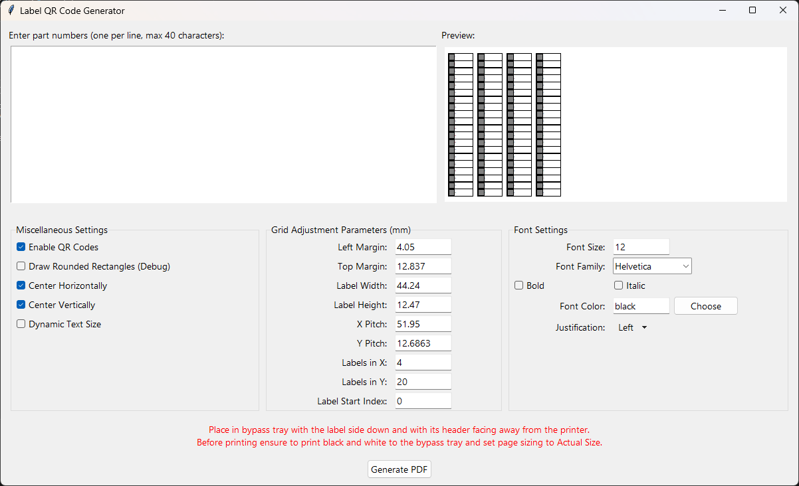

# QR Code Label Generator for Avery 5167

This tool generates a PDF containing QR codes and custom text for Avery Template 5167 Mailing Labels (1/2" x 1-3/4" or 1.3cm x 4.5cm). It offers a rich feature set to customize label content, including QR code generation, text formatting, and label layout adjustments.

## Features
- **Generate QR Codes & Text Labels**: Automatically generate labels containing QR codes and corresponding text.
- **Customizable Layout**: Adjust margins, label dimensions, pitch (spacing), and more to perfectly fit your Avery Template 5167 labels.
- **Text & QR Code Formatting**: Choose font style, size, and color. Enable or disable QR codes, and dynamically resize text to fit within label boundaries.
- **Live Preview**: Preview the label layout before generating the final PDF.
- **Multi-Sheet Support**: Automatically calculate the number of pages required based on the number of labels and the template settings.

## Prerequisites
- **Python 3.x**
- **Required Packages**:
  - `Pillow`: Image processing (for QR codes).
  - `reportlab`: PDF generation.
  - `qrcode`: QR code generation.
  - Install packages using `pip`:
    ```bash
    pip install pillow reportlab qrcode[pil]
    ```

## How to Use

1. **Run the Tool**: Launch the tool by running the Python script.
    ```bash
    python qr_code_label_generator.py
    ```

2. **Input Part Numbers**: Enter your part numbers in the text area on the left panel. Each part number should be on a new line, and can be up to 40 characters long.

3. **Customize Label Layout**:
   - Adjust grid parameters (left margin, top margin, label width, height, pitch, etc.).
   - Specify the number of labels in the x and y directions.
   - Choose the starting index if you want to skip certain labels on a sheet.

4. **Set Miscellaneous Options**:
   - **Enable QR Codes**: Toggle QR code generation on or off.
   - **Draw Debug Rectangles**: Show rounded rectangles around labels for debugging purposes.
   - **Center Labels**: Center the labels horizontally and vertically within the page.

5. **Customize Text Formatting**:
   - Choose font family, size, and color.
   - Enable bold or italic text styles.
   - Set text justification (left, center, or right).

6. **Preview Changes**: Use the live preview panel to visualize how the labels will appear on the page.

7. **Generate PDF**: Click the "Generate PDF" button to save the labels as a PDF file. The PDF will contain all the labels formatted according to your settings.

## Layout Tips for Avery 5167 Labels
- **Margins**: Set appropriate margins for accurate label placement. Defaults are `4.05 mm` for the left margin and `12.837 mm` for the top margin.
- **Label Dimensions**: Avery 5167 labels have a width of `44.24 mm` and a height of `12.47 mm`.
- **Pitch**: The x-pitch is `51.95 mm`, and the y-pitch is `12.6863 mm`, ensuring proper spacing between labels.

## Example Usage
An example configuration for Avery 5167 labels would look like this:
- **Left Margin**: `4.05 mm`
- **Top Margin**: `12.837 mm`
- **Label Width**: `44.24 mm`
- **Label Height**: `12.47 mm`
- **X Pitch**: `51.95 mm`
- **Y Pitch**: `12.6863 mm`
- **Labels in X**: `4`
- **Labels in Y**: `20`

## Keyboard Shortcuts
- **Generate PDF**: Press `Ctrl + S` to generate a PDF quickly.
- **Quit Application**: Press `Escape` to exit the application.

## Screenshot



## Printing Instructions
- Place the Avery 5167 label sheet in your printer's bypass tray with the label side down and the header facing away from the printer.
- Ensure your printer settings are set to **Black and White**, print to the **bypass tray**, and set **page sizing to "Actual Size"** for accurate label alignment.

## License
This project is licensed under the MIT License - see the [LICENSE](LICENSE) file for details.
